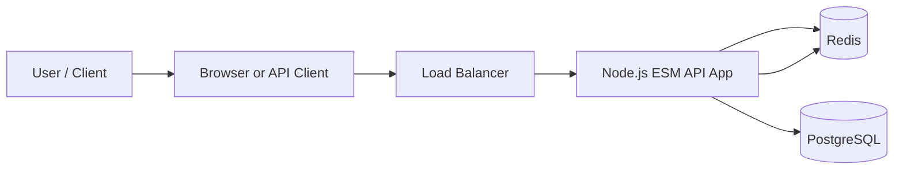
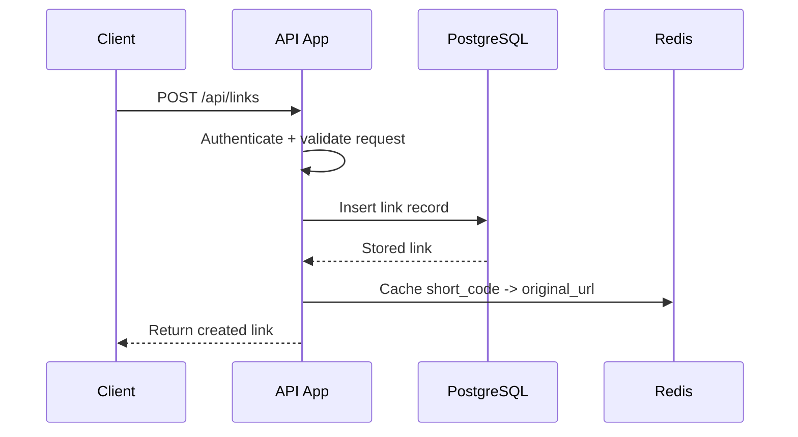
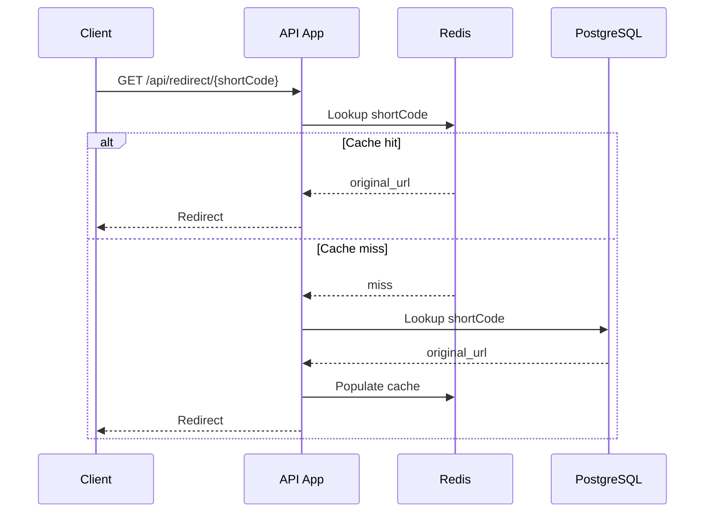

# High Level Design: URL Shortener

## 1. Purpose
This document describes the high-level system design for the URL shortener backend. The design prioritizes fast redirects, simple initial implementation, and a clean path to scale.

## 2. System Goals
- Provide fast redirect responses.
- Support authenticated link creation and management.
- Store session information in Redis.
- Keep the system production-oriented but simple at first.
- Allow future separation into services if scale requires it.

## 3. High Level Architecture

## 4. Core Components

### 4.1 Client Layer
- Sends requests to create, manage, and open short links.
- Redirect requests are public and must stay fast.

### 4.2 Load Balancer
- Distributes incoming traffic across application instances.
- Helps with horizontal scaling later.

### 4.3 Application Layer
- Built as a monolith with internal modules.
- Written in TypeScript using ESM-only modules.
- Handles authentication, authorization, link management, and redirects.

### 4.4 Redis
- Stores session information.
- Stores short-code to destination URL mappings for fast lookup.
- Acts as the first stop for redirect requests.

### 4.5 PostgreSQL
- Source of truth for users, links, and access control.
- Stores canonical link records and relationship data.

## 5. Request Flow

### 5.1 Create Link Flow

### 5.2 Redirect Flow

## 6. Data Ownership
- PostgreSQL owns all persistent link and user data.
- Redis is a performance layer and should not be treated as the source of truth.

## 7. Failure Handling
- If Redis misses, the app falls back to PostgreSQL.
- If Redis is temporarily unavailable, redirects should still work through PostgreSQL fallback.
- If PostgreSQL is unavailable, the system cannot create or resolve uncached links reliably.

## 8. Scalability View
- Small scale: single app instance, Redis, and PostgreSQL.
- Medium scale: multiple app instances behind a load balancer.
- Large scale: add read replicas, caching optimizations, and abuse controls.
- Future scale: split modules into services if the team or traffic requires it.

## 9. Security View
- Authenticated endpoints require session validation from Redis.
- Public redirect endpoints should still be protected against abuse and invalid access patterns.
- Access mode should be enforced before returning a destination URL.

## 10. Non-Goals For Now
- Analytics
- QR code generation
- Group sharing
- Microservices
- Event streaming

## 11. Summary
The system is designed as a TypeScript ESM monolith with modules, using PostgreSQL as the source of truth and Redis for redirect/cache/session performance. This keeps the first version simple while still being production-oriented.
